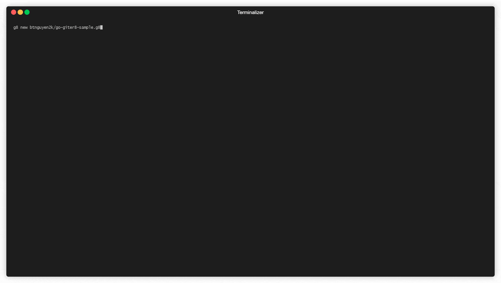

This template demonstrates [go-giter8](https://github.com/btnguyen2k/go-giter8).

## Create new project from template

Run the following command to generate project:

```
$ g8 new btnguyen2k/go-giter8-sample.g8
```


## Generate scaffold

After the project has been generated, `chdir` to the project's directory and run the following command to generate scaffold:

```
$ g8 scaffold <scaffold-name>
```

Example:

```
$ g8 scaffold module1
```


```
$ g8 scaffold module2
```

